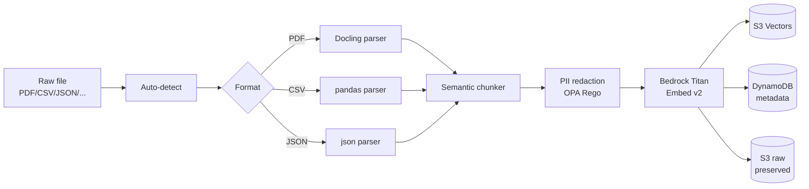
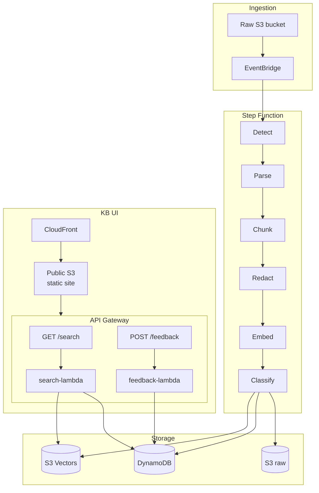

# DataCurator

> Multi-format data curator agent. Turns raw files (PDF, CSV, JSON, HTML, audio, image, video) into an agent-readable knowledge base. Config-driven, cloud-portable, self-learning.

[](LICENSE)


---

## What this solves

Most agent project time is data wrangling. Every downstream agent project needs its own brittle ETL pipeline to ingest documents, chunk them, redact PII, and build a vector index. Each pipeline is hard-coded to one format and one cloud.

DataCurator replaces **N pipelines** with **one declarative system** where every data source is a YAML file in git, every parser/embedder/chunker is pluggable, and the same codebase deploys to any AWS account via a single bootstrap script.



## Key features

- **Multi-format ingestion** — PDF (via Docling), CSV, JSON, HTML, audio (Whisper), image (ColPali), video
- **Format auto-detection** — no manual routing, content-type + magic-byte detection
- **Semantic chunking** — config-driven, per-source-type
- **PII redaction** — OPA/Rego policies, applied before embedding
- **Self-learning classifier** — weekly DSPy prompt optimization from user feedback
- **Cloud-portable** — same codebase deploys to any AWS account (or Azure/GCP in Phase 4)
- **GitOps** — every data source, parser, chunker, embedder, policy is a YAML/Rego file in git
- **Zero-idle cost** — serverless, no always-on compute

## Architecture at a glance



Full architecture: see [`docs/architecture/00-overview.md`](docs/architecture/00-overview.md).

## What you'll find here

| Area | Path |
| --- | --- |
| **High-Level Design** | [`docs/architecture/01-hld.md`](docs/architecture/01-hld.md) |
| **Low-Level Design** | [`docs/architecture/02-lld.md`](docs/architecture/02-lld.md) |
| **Component diagram** | [`docs/architecture/03-component-diagram.md`](docs/architecture/03-component-diagram.md) |
| **Data flow** | [`docs/architecture/04-data-flow.md`](docs/architecture/04-data-flow.md) |
| **Security model** | [`docs/architecture/06-security-model.md`](docs/architecture/06-security-model.md) |
| **Cost model** | [`docs/architecture/07-cost-model.md`](docs/architecture/07-cost-model.md) |
| **ADRs** (decision log) | [`docs/adr/`](docs/adr/) |
| **Runbooks** | [`docs/runbooks/`](docs/runbooks/) |
| **API reference** | [`docs/api/rest-api.md`](docs/api/rest-api.md) |
| **Data model** | [`docs/data-model.md`](docs/data-model.md) |

## Quick start (deploy to a new AWS account)

```bash
# 1. One-time setup: bootstrap state backend + GitHub OIDC provider
bash scripts/bootstrap.sh datacurator dev ap-south-1

# 2. Initialize Terraform
cd infra/terraform
terraform init \
  -backend-config="bucket=datacurator-tfstate-dev" \
  -backend-config="region=ap-south-1" \
  -backend-config="dynamodb_table=datacurator-tfstate-lock-dev"

# 3. Review the plan (read-only)
terraform plan -var-file=envs/dev.tfvars

# 4. Apply
terraform apply -var-file=envs/dev.tfvars
```

End-to-end deploy: ~10 minutes. See [`docs/runbooks/deploy.md`](docs/runbooks/deploy.md).

## Quick start (local development)

```bash
# Install dependencies
pip install -e ".[dev]"

# Run unit tests
pytest tests/unit -v

# Run linting
ruff check src tests
ruff format --check src tests

# Type check
mypy src
```

## Cost model (ap-south-1, per test run)

| Component | Cost |
| --- | --- |
| Lambda invocations | $0.001–0.005 |
| Step Function transitions (~8 per job) | $0.0002 |
| Bedrock Titan Embed v2 (1M tokens) | $0.02 |
| S3 Vectors storage (1 GB) | $0.04 / month |
| S3 Vectors query (1K queries) | $0.004 |
| DynamoDB on-demand | $0.05–0.15 |
| **Per-test total** | **$0.10–0.30** |
| **Idle monthly** | **~$0.50** |

See [`docs/architecture/07-cost-model.md`](docs/architecture/07-cost-model.md) for full breakdown.

## Security

- **No long-lived AWS credentials** — GitHub Actions assume role via OIDC with sub-claim scoped to this repo + branch
- **No secrets in repo** — `.gitignore` + pre-commit `gitleaks` + CI secret-scan
- **Least-privilege IAM** — every role scoped to `Project=datacurator` tag
- **All buckets encrypted** at rest with AES-256 (S3) and KMS (DynamoDB, S3 Vectors)
- **All data in transit** encrypted with TLS 1.2+
- **Public bucket restricted** to static UI assets only; no list/read of raw data from public

See [`SECURITY.md`](SECURITY.md) and [`docs/architecture/06-security-model.md`](docs/architecture/06-security-model.md).

## License

Apache 2.0 — see [`LICENSE`](LICENSE).
