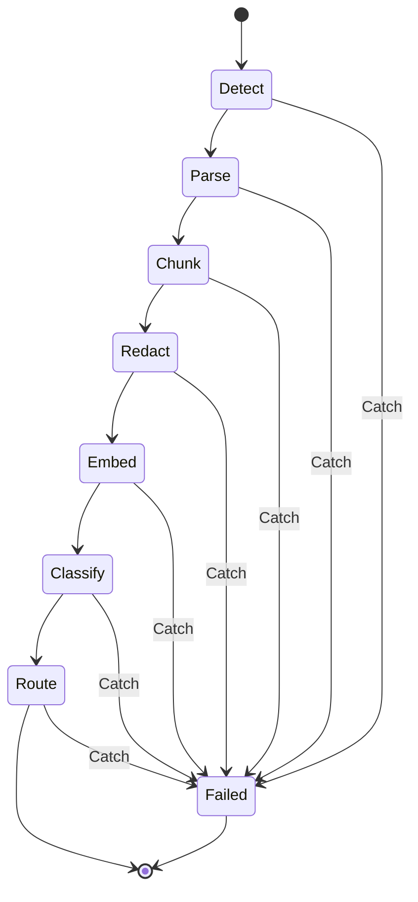

# ADR-0007: Use Step Functions for pipeline orchestration, not chained Lambdas

- **Status**: Accepted
- **Date**: 2026-08-27
- **Deciders**: Vijay Madhu, Mavis
- **Tags**: orchestration, serverless

## Context and problem statement

The ingestion pipeline has 8 stages: detect → parse → chunk → redact → embed → classify → route → notify. We need to orchestrate these.

Options:

1. **Chained Lambdas** — each Lambda invokes the next via async invocation
2. **Step Functions** — managed state machine with retries, error handling, visualization
3. **EventBridge + SQS** — event-driven, decoupled
4. **ECS Fargate task** — long-running container

## Decision drivers

- **Visibility** — pipeline state must be inspectable mid-run
- **Error handling** — partial failures must be retryable without restarting
- **Long-running support** — some formats (large PDFs) take 30+ seconds
- **Cost** — side-project, low volume
- **Operational simplicity** — minimal custom code

## Considered options

### Option 1: Chained Lambdas (async invocations)

- ✅ Simple to set up
- ❌ No built-in state tracking
- ❌ Error handling requires custom DLQ logic per Lambda
- ❌ Hard to debug a stuck pipeline
- ❌ No native retry/backoff per stage

### Option 2: AWS Step Functions (chosen)

- ✅ **Visual state machine** in AWS console
- ✅ **Built-in retries** with exponential backoff
- ✅ **Native error handling** (Catch, Retry, Parallel, Choice)
- ✅ **Integration with Lambda, S3, DynamoDB, Bedrock** without code
- ✅ **Execution history** for every run
- ✅ **Pay per state transition** ($0.025/1K), low cost
- ⚠️ ASL (Amazon States Language) is a learning curve
- ⚠️ 256KB payload limit per state

### Option 3: EventBridge + SQS

- ✅ Decoupled, scalable
- ❌ Custom orchestration code required
- ❌ No built-in state machine
- ❌ Harder to reason about a single run

### Option 4: ECS Fargate

- ✅ Full control, no time limits
- ❌ Always-on or scheduled, more complex
- ❌ Overkill for this workload

## Decision outcome

**Chosen option 2: AWS Step Functions (Standard workflow).**

The state machine is defined in `infra/terraform/modules/step-function/main.tf` using `aws_sfn_state_machine` and the Amazon States Language inline.

Stages:

Each stage:
- **Retries**: 3 with exponential backoff (1s, 5s, 25s)
- **Catches**: sends to a `datacurator-jobs-failed` SNS topic
- **Timeout**: 5 minutes per stage (15 minutes for the whole run)

### Consequences

**Positive**

- Visual debugging in AWS Console
- Built-in retry semantics (no custom code)
- Free execution history (90 days)
- Cost: ~$0.0003 per pipeline run

**Negative**

- 256KB payload limit — large metadata goes to DynamoDB, only IDs in the state
- ASL learning curve for future contributors
- Cannot easily pass large binary data (PDF text) between states — stored in S3 intermediate

### Confirmation

- All 8 stages retryable independently
- Failed runs surface in SNS within 30 seconds
- Total cost per 10K pipeline runs < $5

## Pros and cons of the options

| Option | Visibility | Error handling | Cost/run | Complexity |
|---|---|---|---|---|
| Chained Lambdas | ❌ None | Custom | Low | Low |
| **Step Functions** | **✅ Visual + history** | **✅ Built-in** | **$0.0003** | **Medium** |
| EventBridge + SQS | ⚠️ Custom | Custom | Low | High |
| ECS Fargate | ⚠️ Logs only | Custom | $0.05+/hr | High |

## References

- [AWS Step Functions developer guide](https://docs.aws.amazon.com/step-functions/latest/dg/welcome.html)
- [Amazon States Language spec](https://states-language.net/spec.html)
- [Step Functions pricing](https://aws.amazon.com/step-functions/pricing/)
