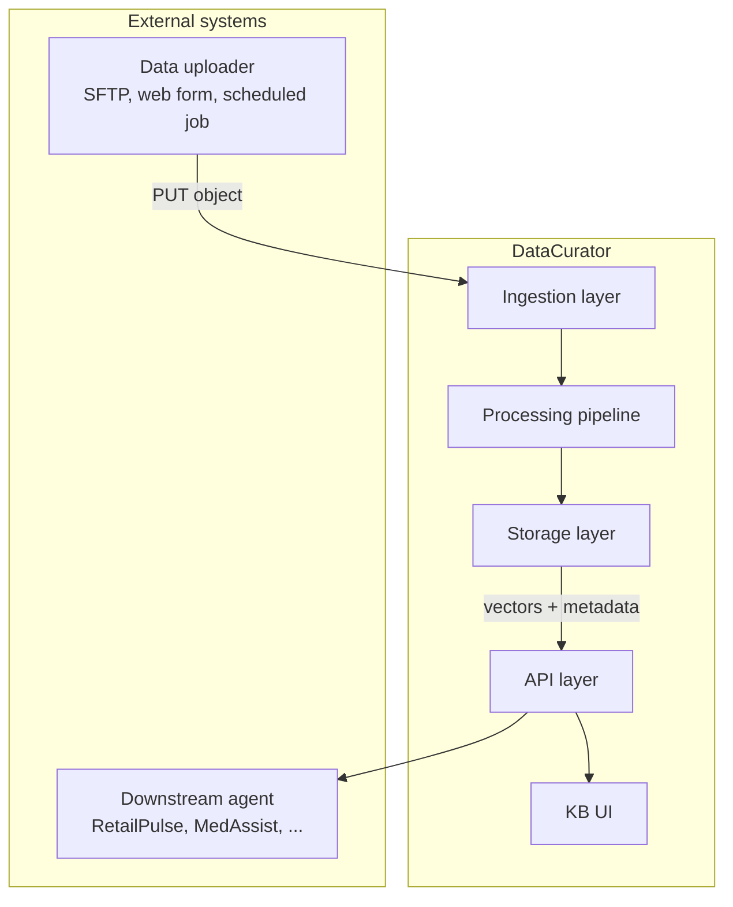
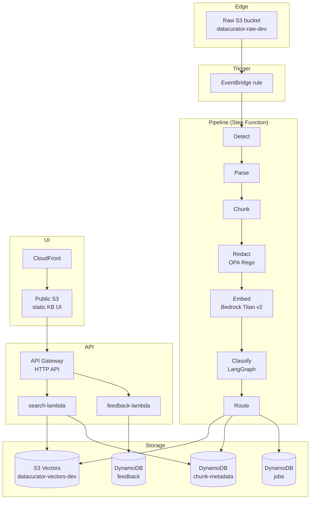

# Architecture Overview

DataCurator is a serverless, event-driven, config-driven data ingestion and curation pipeline that transforms raw files (PDF, CSV, JSON, HTML, audio, image, video) into an agent-readable knowledge base. The same codebase deploys to any AWS account via a single bootstrap script.

## System context

## High-level architecture

## Key flows

### Ingestion flow

1. **Upload** — File lands in `s3://datacurator-raw-dev/ingests/{source}/{date}/{filename}`
2. **Trigger** — S3 ObjectCreated event → EventBridge rule → Step Function execution
3. **Detect** — Lambda inspects file extension + magic bytes → format (PDF, CSV, etc.)
4. **Parse** — Format-specific parser extracts text + structure (tables, images, etc.)
5. **Chunk** — Semantic chunker splits text into 200–500 token chunks with overlap
6. **Redact** — OPA Rego policy removes PII (emails, phones, Aadhaar, etc.)
7. **Embed** — Bedrock Titan v2 generates 1024-dim vector per chunk
8. **Classify** — LangGraph classifier assigns category + tags
9. **Route** — Vector → S3 Vectors; metadata → DynamoDB; raw → preserved in S3

### Search flow (KB UI)

1. **User** types query in KB UI
2. **UI** → API Gateway `GET /search?q=...`
3. **search-lambda** embeds query with Bedrock Titan v2
4. **search-lambda** queries S3 Vectors for top-10 similar chunks
5. **search-lambda** fetches metadata from DynamoDB
6. **UI** renders results with source attribution, format, timestamp, similarity score

### Feedback flow (KB UI)

1. **User** clicks "Mark misrouted" or "Mark misclassified" on a chunk
2. **UI** → API Gateway `POST /feedback`
3. **feedback-lambda** writes to DynamoDB `feedback` table
4. **(Phase 3)** Weekly EventBridge schedule → DSPy prompt optimization job → auto-PR

## Why this design

| Concern | Decision | Why |
| --- | --- | --- |
| Serverless | Lambda + Step Functions + S3 + DynamoDB | Zero idle cost, no cluster management |
| Config-driven | All behavior in YAML/Rego | Same codebase, different configs per project |
| Cloud-portable | Terraform + data sources + bootstrap script | Deploy to any AWS account in 10 min |
| Secure | OIDC, gitleaks, IAM scoped to tags | Public repo safe, least privilege |
| Self-learning | DSPy prompt optimization from feedback | Improves weekly without manual retraining |
| Cost-aware | S3 Vectors over OpenSearch, pay-per-use everywhere | <$5/mo idle, <$0.30/test |

## Where to read next

- **HLD** — [`01-hld.md`](01-hld.md) — service boundaries, deployment topology
- **LLD** — [`02-lld.md`](02-lld.md) — internal component design, data structures
- **Component diagram** — [`03-component-diagram.md`](03-component-diagram.md) — modules and interfaces
- **Data flow** — [`04-data-flow.md`](04-data-flow.md) — sequence diagrams, transformations
- **Deployment** — [`05-deployment-diagram.md`](05-deployment-diagram.md) — AWS topology
- **Security** — [`06-security-model.md`](06-security-model.md) — threat model, trust boundaries
- **Cost** — [`07-cost-model.md`](07-cost-model.md) — per-component cost, comparisons
