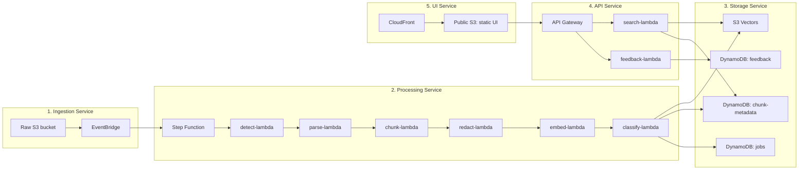
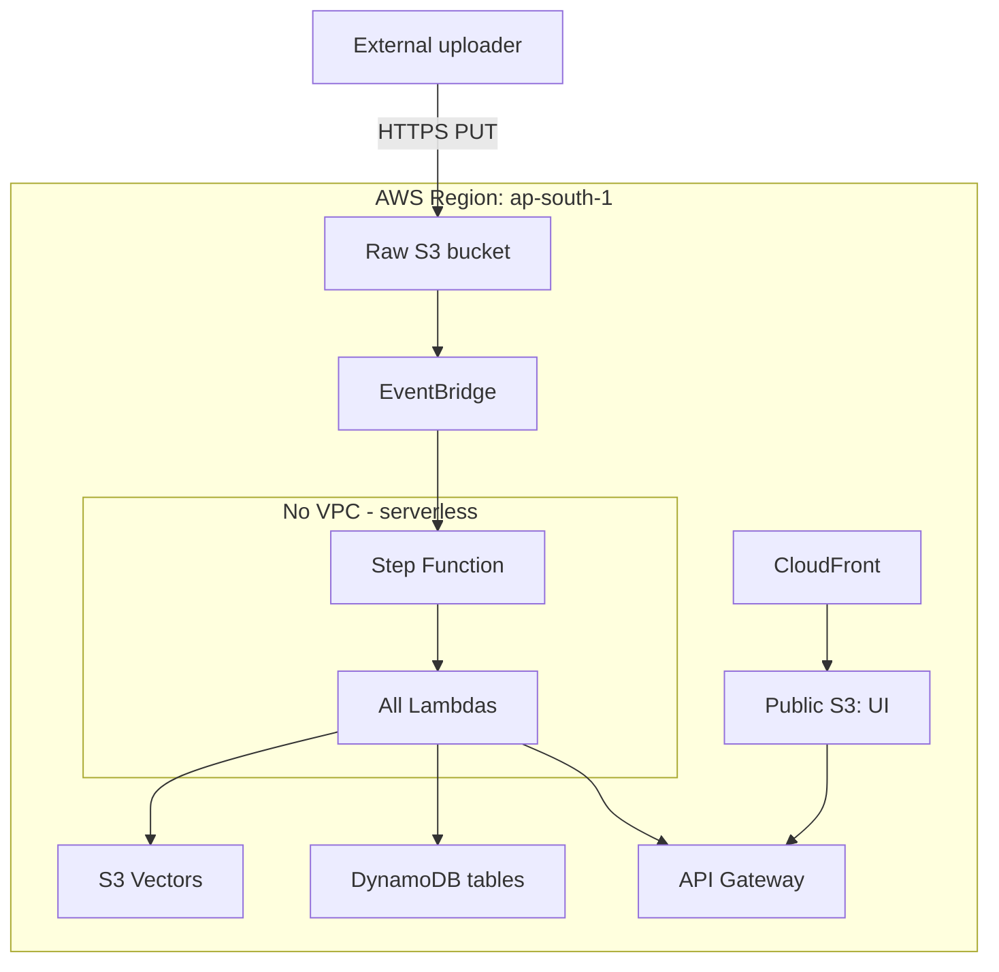

# High-Level Design (HLD)

## Purpose

This document describes the service boundaries, deployment topology, and external interfaces of DataCurator. It is the **first** level of detail above the [overview](00-overview.md) and **higher** level than the [LLD](02-lld.md).

## Audience

- Engineers integrating with DataCurator
- Architects reviewing the design
- New team members onboarding
- Recruiters and hiring managers evaluating the work

## Service boundaries

DataCurator is composed of **5 logical services**, all deployed as AWS managed services:

## Each service, in plain English

### 1. Ingestion Service

**Responsibility**: Accept files, trigger the pipeline.

- **S3 raw bucket** — Public write blocked, only the data-curator role can write
- **EventBridge rule** — Listens for `s3:ObjectCreated:*` events with prefix `ingests/`

**SLA**: Event delivery within 5 seconds of upload.

### 2. Processing Service

**Responsibility**: Transform raw bytes into structured, embedded chunks.

- **Step Function** — Coordinates the 6-stage pipeline with retries and error handling
- **6 Lambda functions** — Each stage is a single-purpose Lambda
- **Bedrock** — Embedding generation (managed, no VPC required)

**SLA**: p95 pipeline run < 60 seconds for typical 1MB PDF.

### 3. Storage Service

**Responsibility**: Persist vectors, metadata, job state, and user feedback.

- **S3 Vectors** — Vector index, top-K similarity search
- **DynamoDB chunk-metadata** — Per-chunk metadata (source, format, timestamps, classification)
- **DynamoDB feedback** — User feedback for the self-learning loop
- **DynamoDB jobs** — Job-level state, costs, errors

**SLA**: Vector query p95 < 200ms; DynamoDB single-digit ms.

### 4. API Service

**Responsibility**: Expose search and feedback to the KB UI and downstream consumers.

- **API Gateway HTTP API** — Cheaper than REST API, lower latency
- **2 Lambdas** — One for read (search), one for write (feedback)

**SLA**: p95 API response < 300ms.

### 5. UI Service

**Responsibility**: Static knowledge-base UI, served globally with low latency.

- **CloudFront** — CDN, HTTPS, custom domain support
- **S3 public bucket** — Static HTML/JS/CSS

**SLA**: First contentful paint < 1.5s globally.

## Deployment topology

**Important**: There is no VPC in this design. All services are AWS-managed and accessed via service endpoints. This eliminates NAT gateway costs, simplifies IAM, and keeps the architecture serverless-pure.

## External interfaces

### Ingestion

| Method | URI | Auth | Body |
|---|---|---|---|
| `PUT` | `s3://datacurator-raw-dev/ingests/{source}/{yyyy}/{mm}/{dd}/{filename}` | IAM | Raw bytes |

### Search (read)

| Method | URI | Auth | Query params |
|---|---|---|---|
| `GET` | `/search` | IAM | `q`, `top_k`, `source_filter`, `format_filter` |

### Feedback (write)

| Method | URI | Auth | Body |
|---|---|---|---|
| `POST` | `/feedback` | IAM | `{chunk_id, label, suggested_class}` |

## Failure modes and degradation

| Failure | Impact | Mitigation |
|---|---|---|
| S3 unavailable | Uploads fail | S3 99.99% SLA; client retry |
| Bedrock unavailable | Embedding fails | Step Function retries 3× with backoff; failed chunks retryable |
| S3 Vectors unavailable | Search fails | Read-only DynamoDB metadata still works; cached results |
| API Gateway unavailable | UI/agents cannot query | CloudFront serves stale UI; consumers must implement retry |
| Single Lambda fails | Only that stage retries | Step Function isolates failures per stage |
| Region down | Total outage | Multi-region is a Phase 5 enhancement; single-region acceptable for side-project |

## What's intentionally NOT in this HLD

- **No Kafka, Kinesis, SQS** — Step Functions + EventBridge suffice for our throughput
- **No ElastiCache / Redis** — Not needed; S3 Vectors + DynamoDB are fast enough
- **No ECS / EKS** — Lambdas handle all compute
- **No VPC** — Serverless endpoints; we trust AWS-managed services
- **No multi-region** — Single-region is acceptable for portfolio scope

## See also

- [Low-Level Design (LLD)](02-lld.md) — Internal data structures, Lambda code structure
- [Component diagram](03-component-diagram.md) — Module dependencies
- [Data flow](04-data-flow.md) — Sequence diagrams
- [Deployment diagram](05-deployment-diagram.md) — More detailed AWS topology
