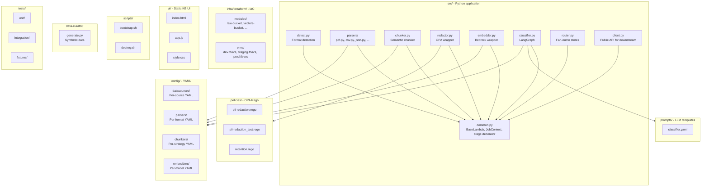
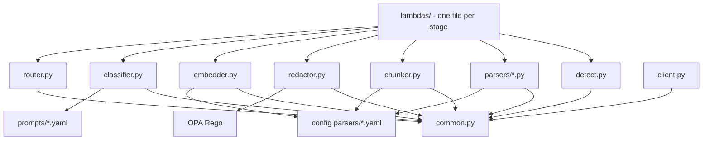
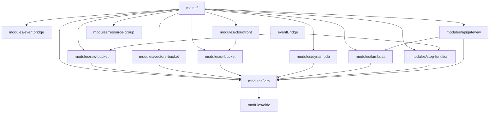
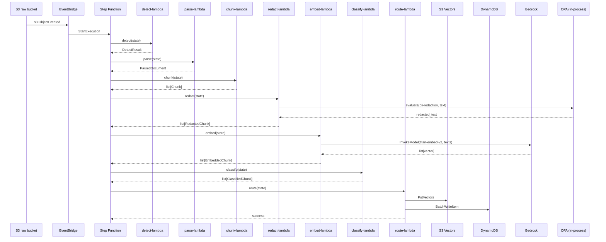
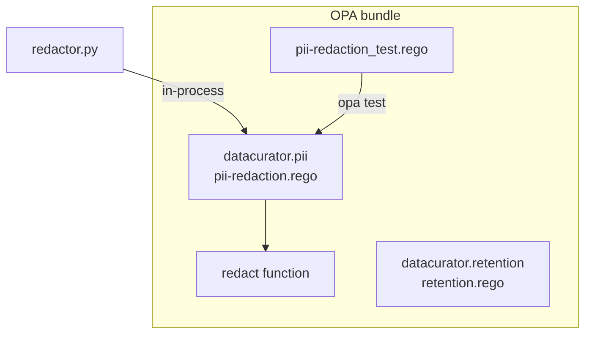

# Component Diagram

## Purpose

This document shows the **internal module structure** of DataCurator and how the Python source, Terraform, and policies are organized into modules. It complements the [HLD](01-hld.md) (which is service-oriented) by showing the **codebase** structure.

## Repository structure (code modules)



## Python module dependency graph



## Terraform module dependency graph



## Data flow at the component level



## Configuration files

Each YAML config is **typed** and **validated** at Lambda startup. A missing field or wrong type fails the Lambda fast.

| Config | Validated by | Used by |
|---|---|---|
| `config/datasources/*.yaml` | Pydantic | Parser, Router |
| `config/parsers/*.yaml` | Pydantic | Parsers |
| `config/chunkers/*.yaml` | Pydantic | Chunker |
| `config/embedders/*.yaml` | Pydantic | Embedder |
| `prompts/*.yaml` | Pydantic | Classifier |
| `policies/*.rego` | OPA test | Redactor |

## OPA policy structure



The OPA bundle is **embedded** in the Lambda deployment package (not loaded from S3 at runtime), so there's no runtime dependency on S3 for policy evaluation.

## Where each component lives

```
datacurator-meta/
├── src/                          # Python application code
│   ├── common.py                 # BaseLambda, JobContext, stage decorator
│   ├── detect.py                 # Format auto-detection
│   ├── parsers/                  # Per-format parsers
│   │   ├── __init__.py
│   │   ├── pdf.py
│   │   ├── csv.py
│   │   ├── json.py
│   │   ├── html.py
│   │   ├── audio.py              # Phase 2
│   │   ├── image.py              # Phase 2
│   │   └── video.py              # Phase 2
│   ├── chunker.py                # Semantic chunking
│   ├── redactor.py               # OPA wrapper
│   ├── embedder.py               # Bedrock wrapper
│   ├── classifier.py             # LangGraph classifier
│   ├── router.py                 # Fan-out to stores
│   ├── client.py                 # Public API for downstream projects
│   ├── lambdas/                  # Lambda entry points
│   │   ├── detect_handler.py
│   │   ├── parse_handler.py
│   │   ├── chunk_handler.py
│   │   ├── redact_handler.py
│   │   ├── embed_handler.py
│   │   ├── classify_handler.py
│   │   ├── route_handler.py
│   │   ├── search_handler.py
│   │   └── feedback_handler.py
│   └── lambdas_layer/            # Shared layer (Pydantic, OPA, boto3)
│       └── python/
├── policies/                     # OPA Rego
│   ├── pii-redaction.rego
│   ├── pii-redaction_test.rego
│   ├── retention.rego
│   └── retention_test.rego
├── prompts/                      # LLM prompt templates
│   └── classifier.yaml
├── config/                       # YAML configurations
│   ├── datasources/
│   ├── parsers/
│   ├── chunkers/
│   └── embedders/
├── infra/terraform/              # IaC
│   ├── main.tf
│   ├── variables.tf
│   ├── providers.tf
│   ├── data.tf
│   ├── locals.tf
│   ├── modules/
│   │   ├── raw-bucket/
│   │   ├── vectors-bucket/
│   │   ├── ui-bucket/
│   │   ├── dynamodb/
│   │   ├── lambdas/
│   │   ├── step-function/
│   │   ├── eventbridge/
│   │   ├── apigateway/
│   │   ├── cloudfront/
│   │   ├── iam/
│   │   ├── oidc/
│   │   └── resource-group/
│   └── envs/
│       ├── dev.tfvars
│       ├── staging.tfvars
│       └── prod.tfvars
├── ui/                           # Static KB UI
│   ├── index.html
│   ├── app.js
│   ├── style.css
│   └── README.md
├── scripts/                      # Operational scripts
│   ├── bootstrap.sh              # One-time setup for a new AWS account
│   ├── destroy.sh                # Tear down
│   └── verify.sh                 # Health check
├── data-curator/                 # Synthetic data generator
│   └── generate.py
├── tests/
│   ├── unit/
│   ├── integration/
│   └── fixtures/
└── docs/                         # Documentation
    ├── architecture/
    ├── adr/
    ├── runbooks/
    └── api/
```

## See also

- [HLD](01-hld.md) — Service boundaries
- [LLD](02-lld.md) — Data shapes and code structure
- [Data flow](04-data-flow.md) — Sequence diagrams
