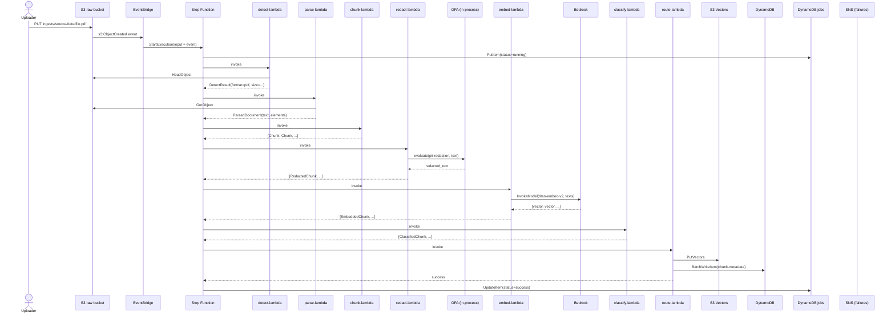
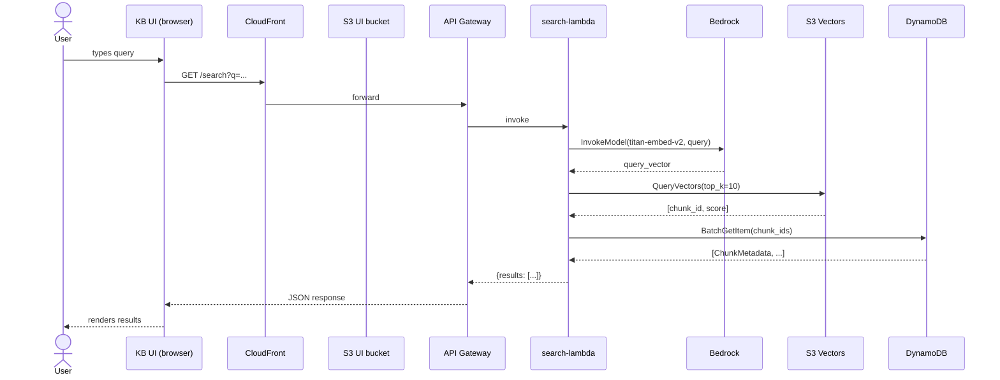
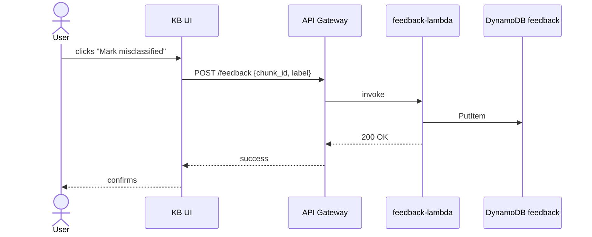
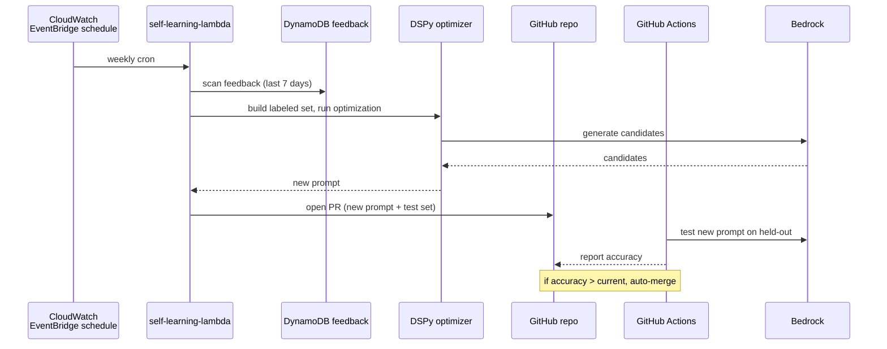

# Data Flow

## Purpose

This document shows the **end-to-end data movement** through DataCurator — from raw upload to query result, with every transformation in between. It complements the [HLD](01-hld.md) and [LLD](02-lld.md) by showing **how data changes** as it flows through the system.

## Ingestion flow (end-to-end)



## Search flow (KB UI)



## Feedback flow (KB UI)



## Self-learning flow (Phase 3)



## Data transformations (what happens to each field)

| Field | Source | Stage 1 (Detect) | Stage 2 (Parse) | Stage 3 (Chunk) | Stage 4 (Redact) | Stage 5 (Embed) | Stage 6 (Classify) | Stage 7 (Route) |
| --- | --- | --- | --- | --- | --- | --- | --- | --- |
| `source_bucket` | S3 event | ✓ | ✓ | ✓ | ✓ | ✓ | ✓ | ✓ |
| `source_key` | S3 event | ✓ | ✓ | ✓ | ✓ | ✓ | ✓ | ✓ |
| `detected_format` | | ✓ (set) | ✓ | | | | | ✓ |
| `text_content` | | | ✓ (set) | split into chunks | redacted | | | |
| `embedding` | | | | | | ✓ (set) | | ✓ |
| `classification` | | | | | | | ✓ (set) | ✓ |
| `chunk_id` | | | | ✓ (UUID) | ✓ | ✓ | ✓ | ✓ |
| `redaction_count` | | | | | ✓ (set) | ✓ | ✓ | ✓ |

## Data retention

| Store | Retention | Cleanup |
| --- | --- | --- |
| S3 raw | 30 days | S3 Lifecycle policy |
| S3 Vectors | Indefinite | Manual |
| DynamoDB chunk-metadata | 90 days | DynamoDB TTL |
| DynamoDB feedback | 1 year | DynamoDB TTL |
| DynamoDB jobs | 1 year | DynamoDB TTL |
| CloudWatch logs | 30 days | Log group retention |

## Storage layout

### S3 raw bucket

```text
s3://datacurator-raw-dev/
└── ingests/
    └── {data_source_name}/
        └── {yyyy}/
            └── {mm}/
                └── {dd}/
                    └── {filename}
```

Example:

```text
s3://datacurator-raw-dev/
└── ingests/
    └── retailpulse/
        └── 2026/
            └── 08/
                └── 27/
                    └── products-2026-q3.pdf
```

### S3 Vectors index

```text
index: datacurator-chunks-v1
dimensions: 1024
distance: cosine

vector[chunk_id] = {
  data: { float32: [0.012, -0.034, ...] },
  metadata: { source: "...", format: "pdf", category: "product-listing" }
}
```

### DynamoDB tables

```text
datacurator-chunk-metadata-dev
  PK: chunk_id (String)
  GSI: source-index  (PK: source_key, SK: created_at)
  GSI: format-index  (PK: detected_format, SK: created_at)
  GSI: job-index    (PK: job_id, SK: chunk_index)
  Attrs: text_preview, token_count, redaction_count, classification, embedding_model, ttl

datacurator-feedback-dev
  PK: feedback_id (String)
  GSI: chunk-index (PK: chunk_id, SK: created_at)
  Attrs: user_id, label, suggested_class, resolved (bool)

datacurator-jobs-dev
  PK: job_id (String)
  GSI: status-index (PK: status, SK: created_at)
  Attrs: source_key, status, chunks_created, total_tokens, cost_estimate_usd, started_at, completed_at, error
```

## What lives where (storage decision matrix)

| Data type | Store | Why |
| --- | --- | --- |
| Raw bytes (original file) | S3 | Cheap, durable, lifecycle-managed |
| Parsed text | (transient) | Not persisted; only chunks stored |
| Chunks (post-redact) | DynamoDB metadata + S3 Vectors | Metadata in DDB for filter, vector in S3V for search |
| Embeddings | S3 Vectors | Purpose-built for similarity search |
| Job state | DynamoDB | ACID, queryable by status |
| Feedback | DynamoDB | ACID, queryable for self-learning |
| Static UI | S3 public | Cheap, CDN-cached |
| Policies | Lambda layer | Embedded, no runtime fetch |
| Configs | Lambda layer | Embedded, no runtime fetch |

## See also

- [HLD](01-hld.md) — Service boundaries
- [LLD](02-lld.md) — Data shapes
- [Component diagram](03-component-diagram.md) — Code structure
- [Deployment diagram](05-deployment-diagram.md) — AWS topology
