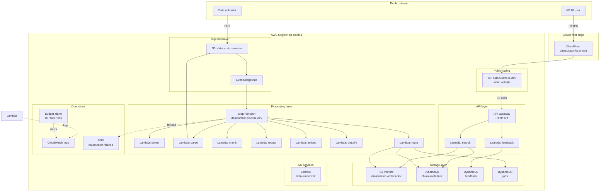
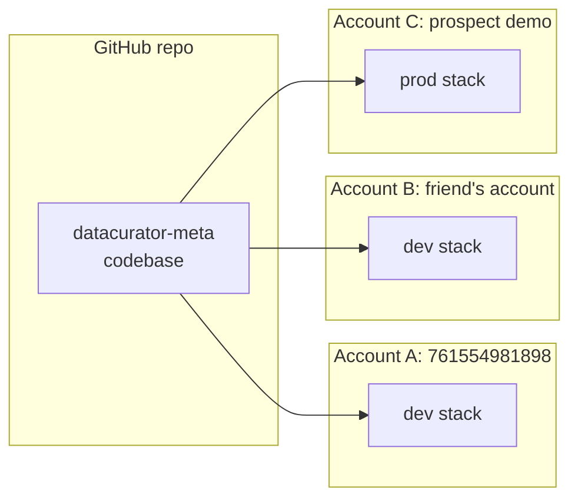
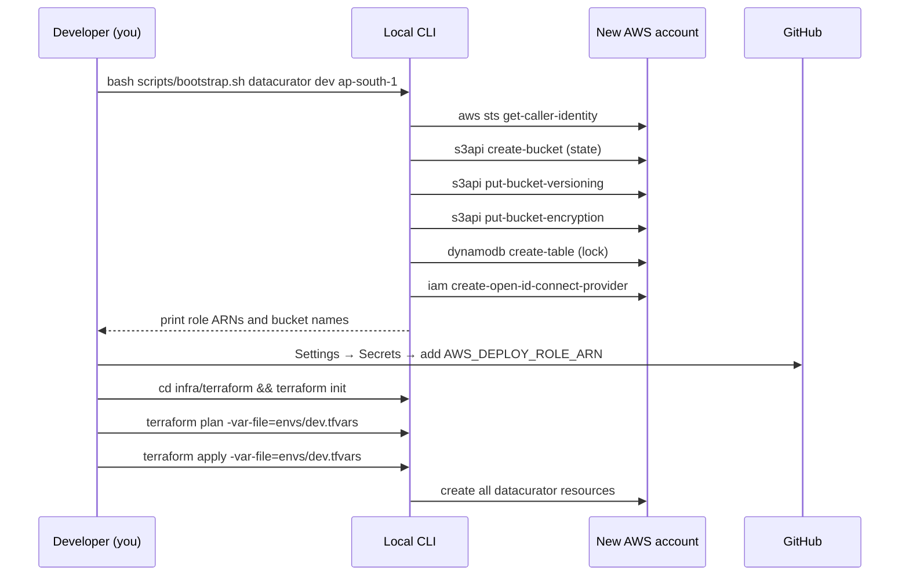

# Deployment Diagram

## Purpose

This document shows the **AWS topology** of a deployed DataCurator instance — what resources exist in which region/account, how they connect, and the network paths data takes.

## Single-account, single-region deployment



## Resources by AWS service

| Service | Resources | Naming |
| --- | --- | --- |
| S3 | 3 buckets | `datacurator-{raw,vectors,ui}-dev` |
| S3 Vectors | 1 index | `datacurator-chunks-v1` (in `datacurator-vectors-dev`) |
| DynamoDB | 3 tables | `datacurator-{chunk-metadata,feedback,jobs}-dev` |
| Lambda | 9 functions | `datacurator-{stage}-dev` |
| Step Function | 1 state machine | `datacurator-pipeline-dev` |
| EventBridge | 1 rule | `datacurator-s3-trigger-dev` |
| API Gateway | 1 HTTP API | `datacurator-api-dev` |
| CloudFront | 1 distribution | `datacurator-kb-ui-cdn-dev` |
| SNS | 1 topic | `datacurator-failures-dev` |
| CloudWatch | Log groups | `/aws/lambda/datacurator-*-dev` |
| Budgets | 1 budget | `datacurator-monthly-dev` |
| IAM | 1 OIDC provider + 7 roles | `datacurator-*` |
| Resource Group | 1 group | `rg-datacurator-dev` |

## No VPC by design

This deployment has **no VPC** because:

1. All services are AWS-managed and accessed via service endpoints
2. Lambda functions run in AWS-managed compute (not in a customer VPC)
3. No RDS, ElastiCache, or EC2 that would require a VPC
4. Eliminates NAT gateway cost (~$32/month per AZ)
5. Eliminates VPC endpoint complexity for S3, DynamoDB, etc.

If Phase 5 introduces a need for private networking (e.g., a customer-managed Redis), a VPC would be added at that point.

## Account-wide controls (assumed pre-existing)

These should be set in the AWS Organization or root account, NOT in this Terraform:

- **Service Control Policies (SCPs)** — region restrictions, service denylist
- **AWS Config rules** — required tags, public bucket detection
- **CloudTrail** — organization-wide audit log
- **IAM Access Analyzer** — unused permission detection
- **GuardDuty** — threat detection

## Tagging strategy

Every resource carries:

```hcl
tags = {
  Project     = "datacurator"
  Environment = "dev"  # dev | staging | prod
  Owner       = "vijay"
  CostCenter  = "portfolio"
  ManagedBy   = "terraform"
  Purpose     = "raw|vectors|ui|api|compute|storage|..."
}
```

Resource Group `rg-datacurator-dev` is filter-based:

```text
ResourceTypeFilters: [all]
TagFilters:
  - Key: Project, Values: [datacurator]
  - Key: Environment, Values: [dev]
```

This shows all datacurator-dev resources in one view, regardless of AWS service.

## Cross-account deployment (multi-account)

To deploy the same codebase to another AWS account:



Each account has its own:

- `bootstrap.sh` run once to set up state backend + OIDC
- `envs/<env>.tfvars` with account ID, region, project name
- GitHub Actions Environment secrets (`AWS_DEPLOY_ROLE_ARN`, `AWS_REGION`)

The codebase is identical; only the tfvars differ.

## Bootstrap process (new AWS account)



## Disaster recovery

| Disaster | Recovery |
| --- | --- |
| Region down | Re-deploy to a new region (multi-region is Phase 5) |
| Accidental bucket delete | Versioning + soft delete; restore from previous version |
| Terraform state corruption | Restore from S3 versioning (S3 has 99.999999999% durability) |
| Bad deploy | `terraform apply` previous commit; OIDC allows rapid rollback |
| Compromised GitHub PAT | Rotate GitHub secrets; OIDC scope is by repo so blast radius is small |

## See also

- [HLD](01-hld.md) — Service boundaries
- [LLD](02-lld.md) — Data shapes
- [Data flow](04-data-flow.md) — Sequence diagrams
- [Security model](06-security-model.md) — Trust boundaries
- [Cost model](07-cost-model.md) — Per-resource cost
- [Bootstrap script](../../scripts/bootstrap.sh) — New-account setup
