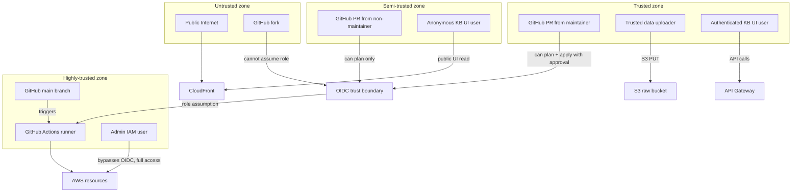
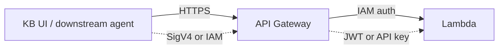

# Security Model

## Purpose

This document describes the **threat model**, **trust boundaries**, **IAM strategy**, and **defense-in-depth** controls of DataCurator. It is required reading for anyone changing IAM, S3 bucket policies, or any other security-sensitive configuration.

## Threat model (STRIDE)

| Threat | Vector | Mitigation |
| --- | --- | --- |
| **Spoofing** | Stolen GitHub PAT, leaked AWS keys | OIDC only; no long-lived secrets; sub-claim scoped to repo + branch |
| **Tampering** | Malicious PR, malicious Lambda code | PR review required; OIDC allows plan-only on PRs; tflint/tfsec in CI; gitleaks pre-commit |
| **Repudiation** | "I didn't deploy that" | CloudTrail logs all `AssumeRoleWithWebIdentity` with sub-claim; every action attributable to a commit |
| **Information disclosure** | Public S3 leak, public API | Public Access Block on raw/vectors; CloudFront OAI for UI; API Gateway IAM auth |
| **Denial of service** | Runaway Lambda, large upload | S3 upload size limits; Lambda concurrency limits; budget alarm |
| **Elevation of privilege** | Wildcard IAM, over-permissive policy | All IAM scoped to `Project=datacurator` tag; tflint rules block wildcards; tfsec in CI |

## Trust boundaries



## IAM strategy

### OIDC trust policy (the single most important security control)

```json
{
  "Version": "2012-10-17",
  "Statement": [{
    "Effect": "Allow",
    "Principal": {
      "Federated": "arn:aws:iam::ACCOUNT:oidc-provider/token.actions.githubusercontent.com"
    },
    "Action": "sts:AssumeRoleWithWebIdentity",
    "Condition": {
      "StringEquals": {
        "token.actions.githubusercontent.com:aud": "sts.amazonaws.com"
      },
      "StringLike": {
        "token.actions.githubusercontent.com:sub": [
          "repo:vijaymadhu/datacurator-meta:ref:refs/heads/main",
          "repo:vijaymadhu/datacurator-meta:pull_request"
        ]
      }
    }
  }]
}
```

What this **allows**:

- A push to `main` from a maintainer in this repo → role assumption
- A PR opened from a maintainer in this repo → role assumption for plan

What this **blocks**:

- A fork attempting to assume the role (different `sub`)
- A PR opened against a different branch (e.g., `feature/...`) by a maintainer
- Any other repo in the org (different `sub`)
- A typo-squatted branch name (must match `refs/heads/main` exactly)

### Per-resource IAM policies

Each Lambda has a single-purpose role. Example for the `redact-lambda`:

```json
{
  "Version": "2012-10-17",
  "Statement": [
    {
      "Sid": "ReadSourceBucket",
      "Effect": "Allow",
      "Action": ["s3:GetObject"],
      "Resource": "arn:aws:s3:::datacurator-raw-dev/*"
    },
    {
      "Sid": "WriteClassifiedBucket",
      "Effect": "Allow",
      "Action": ["s3:PutObject"],
      "Resource": "arn:aws:s3:::datacurator-raw-dev/processed/*"
    },
    {
      "Sid": "WriteJobStatus",
      "Effect": "Allow",
      "Action": ["dynamodb:PutItem", "dynamodb:UpdateItem"],
      "Resource": "arn:aws:dynamodb:ap-south-1:ACCOUNT:table/datacurator-jobs-dev"
    },
    {
      "Sid": "WriteLogs",
      "Effect": "Allow",
      "Action": ["logs:CreateLogGroup", "logs:CreateLogStream", "logs:PutLogEvents"],
      "Resource": "arn:aws:logs:ap-south-1:ACCOUNT:log-group:/aws/lambda/datacurator-redact-dev:*"
    }
  ]
}
```

**No `*` actions. No `*` resources. Every permission justified.**

### IAM policy validation

CI runs `tfsec` and `checkov` on every PR. Both flag:

- Wildcard actions (`*:*`)
- Wildcard resources (`*`)
- Unused permissions
- Overly permissive policies

## S3 bucket security

### Raw bucket (`datacurator-raw-dev`)

```hcl
resource "aws_s3_bucket_public_access_block" "raw" {
  bucket = aws_s3_bucket.raw.id

  block_public_acls       = true
  block_public_policy     = true
  ignore_public_acls      = true
  restrict_public_buckets = true
}
```

- **Encryption**: AES-256 (S3-managed)
- **Versioning**: enabled
- **Public access**: fully blocked
- **Access logging**: enabled (logs to a separate log bucket)
- **Lifecycle**: 30-day expiration

### Vector bucket (`datacurator-vectors-dev`)

- Same controls as raw bucket
- Plus: server-side encryption with KMS (CMK)
- Plus: replication to a backup region (Phase 5)

### UI bucket (`datacurator-ui-dev`) — INTENTIONALLY PUBLIC for static assets

- **Public ACLs**: allowed (only for `static/` prefix)
- **Bucket policy**: allows `s3:GetObject` on `arn:aws:s3:::datacurator-ui-dev/static/*`
- **CloudFront OAC**: CloudFront uses Origin Access Control to read private content; public only via CloudFront URL
- **No list/read of `raw/`, `vectors/`, or any other prefix**

```hcl
# Bucket policy: public read on static/ only
resource "aws_s3_bucket_policy" "ui" {
  bucket = aws_s3_bucket.ui.id
  policy = jsonencode({
    Version = "2012-10-17"
    Statement = [
      {
        Sid       = "PublicReadStaticOnly"
        Effect    = "Allow"
        Principal = "*"
        Action    = "s3:GetObject"
        Resource  = "arn:aws:s3:::datacurator-ui-dev/static/*"
      },
      {
        Sid       = "CloudFrontOACRead"
        Effect    = "Allow"
        Principal = { "AWS": "arn:aws:iam::cloudfront:user/CloudFront Origin Access Control ..." }
        Action    = "s3:GetObject"
        Resource  = "arn:aws:s3:::datacurator-ui-dev/*"
      }
    ]
  })
}
```

## API Gateway security



- **HTTP API** (cheaper, lower latency than REST)
- **IAM authentication** (not API keys) — uses SigV4
- **Throttling**: 100 RPS burst, 50 RPS sustained (configurable)
- **WAF** (Phase 5) — SQL injection, XSS, common attacks

## Encryption

| Data | At rest | In transit |
| --- | --- | --- |
| S3 raw | AES-256 | TLS 1.2+ |
| S3 vectors | AES-256 | TLS 1.2+ |
| S3 UI | AES-256 | TLS 1.2+ |
| DynamoDB | AWS-managed KMS | TLS 1.2+ |
| CloudWatch logs | AES-256 | TLS 1.2+ |
| Lambda env vars | AES-256 (KMS) | TLS 1.2+ |

## Secret management

- **No secrets in code** — verified by gitleaks pre-commit and CI
- **No secrets in GitHub Actions secrets** — only role ARNs and region
- **No secrets in environment variables** — runtime secrets use SSM Parameter Store with SecureString
- **No secrets in logs** — Lambda log sanitization via `boto3` redact

## Audit trail

Every action is logged:

- **CloudTrail** — all API calls, all `AssumeRoleWithWebIdentity` with `sub` claim
- **S3 server access logs** — all bucket requests
- **Lambda logs** — every invocation, every state transition
- **CloudWatch** — custom metrics + alarms
- **GitHub Actions** — every workflow run, every secret access

## Compliance posture

For the side-project scope, DataCurator follows the AWS Well-Architected Framework's Security pillar:

- ✅ Identity and access management (least privilege, OIDC)
- ✅ Detective controls (CloudTrail, CloudWatch, Config)
- ✅ Infrastructure protection (no public S3 except UI; VPC-free serverless)
- ✅ Data protection (encryption at rest + in transit)
- ✅ Incident response (runbooks in `docs/runbooks/incident-response.md`)

Not in scope (side-project, not enterprise):

- ❌ SOC 2 audit
- ❌ HIPAA / FedRAMP compliance
- ❌ Penetration testing
- ❌ Bug bounty program

## When to escalate

If you discover a security issue:

1. **Do not** open a public GitHub issue
2. **Do** report via GitHub Security Advisories or email (see [SECURITY.md](../../SECURITY.md))
3. **Do** check if the issue affects production (`prod` env)
4. **Do** consider if existing data is at risk (PII leak, etc.)

## See also

- [SECURITY.md](../../SECURITY.md) — Vulnerability disclosure policy
- [ADR-0004: Use GitHub OIDC](../adr/0004-use-github-oidc-no-long-lived-aws-keys.md) — OIDC rationale
- [ADR-0008: Use OPA Rego](../adr/0008-use-opa-rego-for-policies.md) — PII policy as data
- [Cost model](07-cost-model.md) — Cost of security controls
