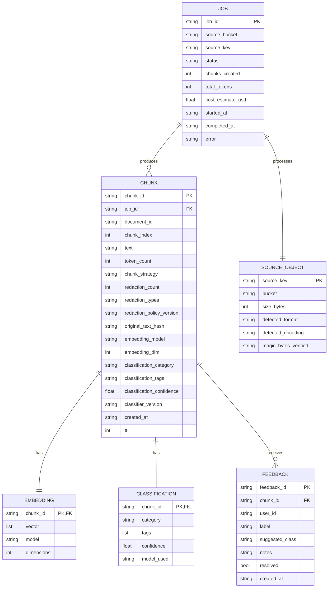

# Data Model

## Purpose

This document is the canonical reference for the **shapes, relationships, and lifecycle** of every data entity in DataCurator. It complements the [LLD](../architecture/02-lld.md) (which is code-oriented) by showing the data from a **domain** perspective.

## Entity-relationship overview



## Entities

### Job

Represents one full pipeline execution.

| Field | Type | Required | Description |
|---|---|---|---|
| `job_id` | UUID | Yes | Primary key |
| `source_bucket` | string | Yes | e.g., `datacurator-raw-dev` |
| `source_key` | string | Yes | e.g., `ingests/retailpulse/2026/08/27/q3.pdf` |
| `status` | enum | Yes | `running` \| `success` \| `failed` \| `partial` |
| `chunks_created` | int | No | Set on success |
| `total_tokens` | int | No | Sum of all chunk token counts |
| `cost_estimate_usd` | float | No | Estimated AWS cost of this run |
| `started_at` | ISO 8601 | Yes | When the Step Function started |
| `completed_at` | ISO 8601 | No | When the Step Function ended |
| `error` | string | No | Set if `status=failed` |
| `error_stage` | string | No | Which stage failed (`Detect`, `Parse`, etc.) |

**Indexes**:

- PK: `job_id`
- GSI: `status-index` (PK: `status`, SK: `started_at`) — find all failed jobs

**Lifecycle**: retained for 1 year via DynamoDB TTL.

### Chunk

The fundamental unit of stored data. One source document produces N chunks.

| Field | Type | Required | Description |
|---|---|---|---|
| `chunk_id` | UUID | Yes | Primary key |
| `job_id` | UUID | Yes | Foreign key to Job |
| `document_id` | UUID | Yes | Logical document identifier (allows re-ingestion) |
| `chunk_index` | int | Yes | 0..N within the document |
| `text` | string | Yes | The chunk text (PII-redacted) |
| `token_count` | int | Yes | Number of tokens in `text` |
| `chunk_strategy` | string | Yes | e.g., `semantic-v1` |
| `redaction_count` | int | No | Number of PII redactions applied |
| `redaction_types` | list[string] | No | e.g., `["email", "phone"]` |
| `redaction_policy_version` | string | No | e.g., `pii-redaction-1.0.0` |
| `original_text_hash` | string | No | SHA-256 of pre-redaction text |
| `embedding_model` | string | No | e.g., `amazon.titan-embed-text-v2:0` |
| `embedding_dim` | int | No | e.g., `1024` |
| `classification_category` | string | No | e.g., `product-listing` |
| `classification_tags` | list[string] | No | e.g., `["apparel", "shirt"]` |
| `classification_confidence` | float | No | 0.0-1.0 |
| `classifier_version` | string | No | e.g., `classifier-v1` |
| `created_at` | ISO 8601 | Yes | When this chunk was created |
| `ttl` | int | Yes | Unix timestamp for DynamoDB TTL (90 days) |

**Indexes**:

- PK: `chunk_id`
- GSI: `source-index` (PK: `source_key`, SK: `created_at`) — find all chunks from a source
- GSI: `format-index` (PK: `detected_format`, SK: `created_at`) — find all PDFs
- GSI: `job-index` (PK: `job_id`, SK: `chunk_index`) — find all chunks in a job

**Stored in**:

- S3 Vectors: `chunk_id → vector + minimal metadata`
- DynamoDB `chunk-metadata`: full attributes

### Embedding

Lives in S3 Vectors. Stored separately from the DynamoDB chunk-metadata for performance.

| Field | Type | Description |
|---|---|---|
| `chunk_id` | UUID | Primary key (also in DynamoDB) |
| `vector` | float32[1024] | The embedding |
| `metadata` | object | Filter metadata: `{source, format, category}` |

**Why separate?**

- Vector search is the hot path; S3 Vectors is purpose-built
- DynamoDB is for rich metadata; S3 Vectors is for vectors
- Different scaling characteristics

### Classification

Embedded in the Chunk record in DynamoDB. Not a separate table.

### Feedback

User feedback on a chunk. Drives the self-learning loop in Phase 3.

| Field | Type | Required | Description |
|---|---|---|---|
| `feedback_id` | UUID | Yes | Primary key |
| `chunk_id` | UUID | Yes | Foreign key to Chunk |
| `user_id` | string | Yes | Who submitted the feedback (from IAM sub-claim) |
| `label` | enum | Yes | `misclassified` \| `misrouted` \| `good` |
| `suggested_class` | string | No | If misclassified, what should it be? |
| `notes` | string | No | Free-text notes |
| `resolved` | bool | Yes | Whether the classifier has been retrained on this |
| `created_at` | ISO 8601 | Yes | Submission time |

**Indexes**:

- PK: `feedback_id`
- GSI: `chunk-index` (PK: `chunk_id`, SK: `created_at`) — find all feedback for a chunk
- GSI: `unresolved-index` (PK: `resolved`, SK: `created_at`) — find all unresolved feedback

**Retention**: 1 year (TTL).

## Cardinality

| Relationship | Cardinality | Example |
|---|---|---|
| Source → Job | 1:1 | One upload → one job |
| Job → Chunk | 1:N | One job → ~10 to ~1000 chunks |
| Chunk → Embedding | 1:1 | Each chunk has one embedding |
| Chunk → Feedback | 1:N | Many users can flag the same chunk |
| Document → Chunk | 1:N | Same document re-ingested creates new chunks (re-processing) |

## Data lineage

```mermaid
graph LR
    Upload[Upload] --> S3[S3 raw]
    S3 --> EB[EventBridge]
    EB --> SF[Step Function]
    SF --> JOB[JOB record]
    SF --> CHUNK1[CHUNK 1]
    SF --> CHUNK2[CHUNK 2]
    SF --> CHUNK3[CHUNK N]
    CHUNK1 --> EMB1[EMBEDDING 1]
    CHUNK2 --> EMB2[EMBEDDING 2]
    CHUNK3 --> EMBN[EMBEDDING N]
    CHUNK1 --> DDB1[DynamoDB]
    CHUNK2 --> DDB2[DynamoDB]
    CHUNK3 --> DDBN[DynamoDB]
    CHUNK1 --> FB[FEEDBACK (later)]
    FB --> SL[Self-learning (Phase 3)]
    SL --> PR[New PR]
    PR --> CLS[Updated classifier]
    CLS --> SF
```

Every chunk can be traced back to:

- The source object (S3 raw key)
- The job that processed it
- The user who gave feedback on it (Phase 3+)
- The model version that classified it

## What is NOT in the data model

- **Raw parsed text** — only chunks are stored; the parsed intermediate is ephemeral
- **Intermediate state** — Step Function state is in its own log
- **Embeddings before redaction** — we never persist unredacted embeddings (security)
- **Source file content** — kept in S3 raw for audit; not duplicated in the data model

## See also

- [LLD](../architecture/02-lld.md) — Code-level data shapes
- [Data flow](../architecture/04-data-flow.md) — How data moves
- [Cost model](../architecture/07-cost-model.md) — Storage cost
